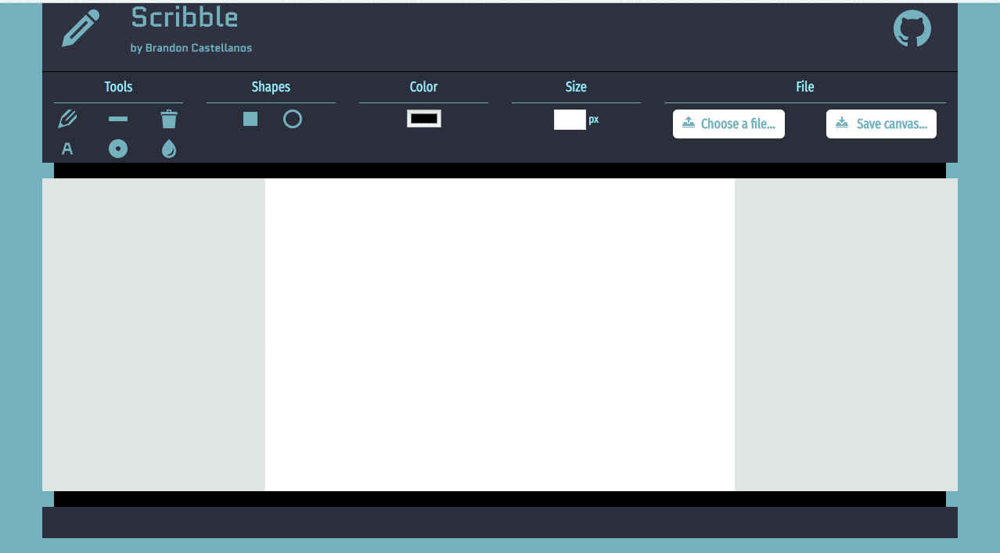

----
&nbsp;&nbsp;&nbsp;&nbsp;&nbsp;&nbsp;&nbsp;&nbsp;&nbsp;&nbsp;&nbsp;

#### A computer graphics application built with HTML5-Canvas.


&nbsp;&nbsp;&nbsp;&nbsp;&nbsp;&nbsp;&nbsp;&nbsp;&nbsp;&nbsp;&nbsp;

## Key Features
----

* Tools
	- Pencil
	- Line
	- Eraser
	- Text
	- Spray
	- Fill
	- Rectangle
	- Circle
* Pickers
	- Color
	- Size
* Files
	- Open File
	- Save Canvas

## Getting Started
----
To run this application on a local server, follow the instructions below.

### Clone Repository
Copy the repository to your machine.
```python
git clone https://github.com/bcastell/scribble
```

### Navigation
Enter the root directory of the local repository with the following command.
```python
cd location/where/repository/is/saved/scribble
```

### Installation
##### Node.js
Ensure Node.js is installed on your computer. If Node.js is not already installed, it can be downloaded [here](https://nodejs.org/en/).
&nbsp;
##### Gulp
Next, install Gulp globally by entering the following command. This way, Gulp can be used anywhere on your system.
```python
sudo npm install gulp -g
```

### Start Server
Now run the following command to spin up a server.
```python
gulp
```
Your default browser should open a new window with the application running.

## Authors
----
* **Brandon Castellanos** - [GitHub](https://github.com/bcastell)

## License
----
This project is licensed under the MIT License - see the [LICENSE](LICENSE) file for details.
